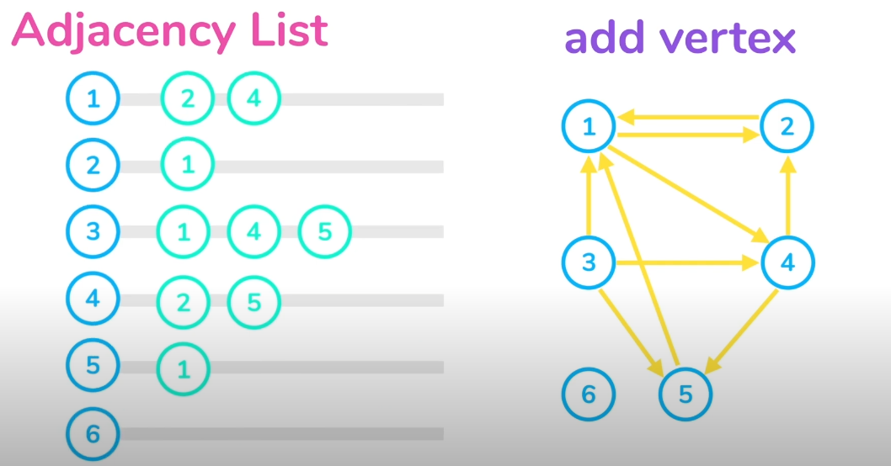

# My notes on DS and Algo

### Table of Contents

1. [Graphs](#Graphs)
   1. [Tree/Graph Traversal Algorithms](#traversal)
   1. [BFS](#bfs)

## Graphs

- Representing Graphs :

  - Adjacency List

    - Every Vertex stores a list of adjacent vertices.
    - Each index of a list could be used to represent the vertex and the elements represent adjacent vertices.

      

  - Adjacency Matrix

### Tree/Graph Traversal Algorithms 

- Breadth-first search is guaranteed to find a shortest possible path between two vertices in a graph. Depth-first search is not (and usually does not).
- DFS is preferred if we want to visit every node in the graph.

#### Breadth-First Traversal 
