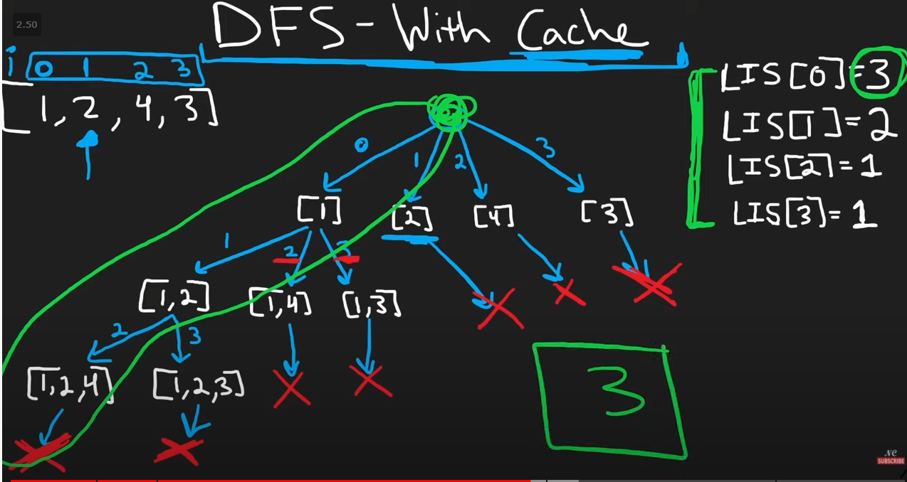

# brute force : ON^2

# DFS with cache



- we start from the back as the back from the end would us the longest subsequence from that number
- we cache the maximum of either the current number or the 1 + the subsequence before that number
  e.g
  list = [1,2,4,3]
  dp = [1,1,1,1]
  dp[3] = 1
  dp[2] = max(dp[2], 1 + dp[3] if list[3]>lis[2] ) = 1)
  dp[1] = max(dp[1], 1 + dp[2] if list[2]>list[1]) = 2)
  dp[0] = max(dp[0], 1 + dp[1] if list[1]>list[0]) = 3)

# Dynamic Programming

Code

```python
class Solution:
    def lengthOfLIS(self, nums: List[int]) -> int:
        dp = [1 for i in range(len(nums))]

        # start from the last index and caculate the longest from end to that index
        for i in range(len(nums),-1,-1):
            for j in range(i + 1, len(nums)): # j is the index after i
                if nums[i] < nums[j]:
                    dp[i] = max(dp[i],1+dp[j]) # maximum of either the current number or the 1 + the subsequence before that number


            continue

        return max(dp)
```
