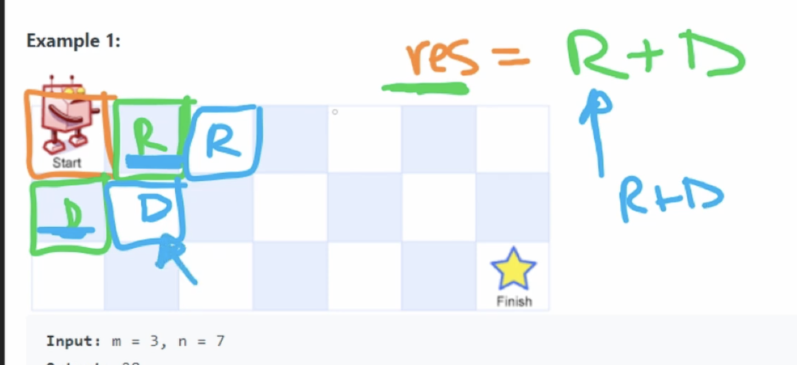
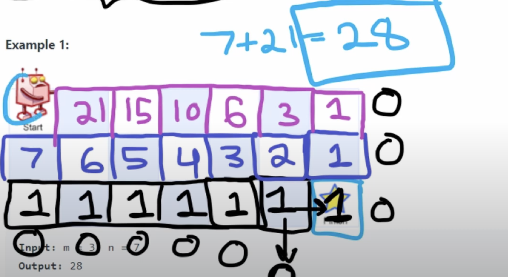

**Approach**

**Recursive Relation:**

- add the number of ways of the bottom and the right of that cell




Approach 1 : DFS + Memoisation

```python
class Solution:
    def uniquePaths(self, m: int, n: int) -> int:
        self.board = []
        self.count = 0
        self.reachEnd = False
        for i in range(m):
            row = []
            for j in range(n):
                row.append([])
            self.board.append(row)
            
        self.board[m-1][n-1] = 1
        self.dfs(0,0,m,n)
                
        return self.count 
    
    def dfs(self,row,column,m,n):
        if column > m-1 or column < 0 or row > m-1 or row < 0: # out of bounds
            return
        
        if row == m and column == n:        # reach end
            self.reachEnd = True
            return
        
        if self.board[row][column] == 1:
            self.count += 1
            return 

        
        # traverse surrounding
        self.dfs(row+1,column,m,n)
        self.dfs(row,column+1,m,n)
        
        
        if self.reachEnd:
            # mark visited if reach end
            self.board[row][column] = 1 
            self.count +=1
        return


```

Approach 2 : recursion with memo(up-bottom)

```python
class Solution:
    def __init__(self):
        self.memo = {}
    
    def uniquePaths(self, m: int, n: int) -> int:
        if (m,n) in self.memo:
            return self.memo[(m,n)]
        if m <= 0 or n <= 0:
            return 0
        if m == 1 or n == 1:
            return 1
        
        ans = self.uniquePaths(m-1,n) + self.uniquePaths(m, n-1)
        self.memo[(m,n)] = ans
        return ans
```


Approach 3 : Iterative + bottom up
- bottom up means to start at the end and build solutions all the way back to the start


From end to start

```python
class Solution:
    def uniquePaths(self, m: int, n: int) -> int:
        row = [1] * n # bottom row, all one
        
        for i in range(m - 1): # going through all the rows
            newRow = [1] * n # new row is going to above the old row
            for j in range(n-2,-1,-1): # to avoid the edge case to check out of bounds, we can start from n-2 as it is all one
                newRow[j] = newRow[j+1] + row[j]
            row = newRow
        
        return row[0] # return the first value of the new row
    # O(N*M) time
    # Memory complexity : Length of row O(N)
        


```

From start to end 
```python
    def uniquePaths(self, m: int, n: int) -> int:
        if m==0 or n == 0 : return 0
        
        dp = [[1 for _ in range(n)] for _ in range(m)]
                
        for row in range(1,m):
            for col in range(1,n): # skip the first row and col due to them being 1
                print(dp[row - 1][col])
                print(dp[row][col - 1])
                dp[row][col] = dp[row - 1][col] + dp[row][col - 1]
        
        return dp[-1][-1]
```

Reference
https://www.youtube.com/watch?v=IlEsdxuD4lY&ab_channel=NeetCode