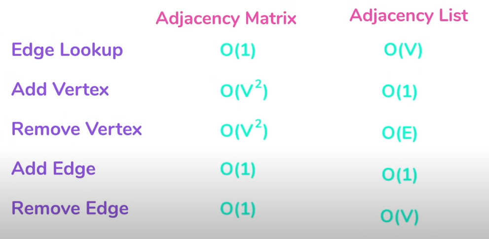

# My notes on DS and Algo

# Table of Contents

1. [Graphs](#Graphs)
   1. [Graph Data Structure](#gds)
   1. [Tree/Graph Traversal Algorithms](#traversal)
      1. [BFS](#bfs)

## Graphs

- Representing Graphs : 

  - [Adjacency List](./Datastructure%20and%20Algo%20in%20Golang/adjacency_list.go)

    - Every Vertex stores a list of adjacent vertices.
    - Each index of a list could be used to represent the vertex and the elements represent adjacent vertices.

      

  - [Adjacency Matrix](././Datastructure%20and%20Algo%20in%20Golang/adjacency_matrix.go)

    - Representing graphs as 2 dimensional matrix.
      - Edge is represented by the value of i,j in matrix.
      - To add a vertex, add a row and column
    - If the graph is weighted, the value of each matrix would be the weights instead of 1s and 0s.
    - If the graph is undirected, it means that there is symmetry about the diagonal of the matrix, because the edges are bi-directional.

    - Comparing Adjacency Matrix and List

      - Matrix requries more space. n^2
      - Adjancy matrix is faster for Edge lookup O(1) vs O(V)
        Time Complexity

        

### Tree/Graph Traversal Algorithms 

- Breadth-first search is guaranteed to find a shortest possible path between two vertices in a graph. Depth-first search is not (and usually does not).
- DFS is preferred if we want to visit every node in the graph.
- DFS : Stack ; BFS : Queue
  

#### [Binary Tree Traversal](././Datastructure%20and%20Algo%20in%20Golang/tree_traversal.go) 

#### In order

1. Visit Left Node
1. Current Node
1. Right Node

#### Pre Order

1. Visit Current Node
1. Visit Left Node
1. Visit Right Node

#### Post Order

1. Visit Left
1. Right
1. Current

#### Depth-First Traversal 

- DFS implements the order traversal just that it has 'visited' mark

#### Breadth-First Traversal 
