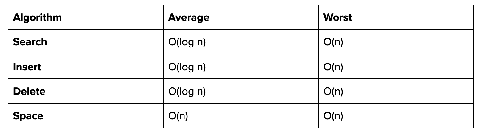
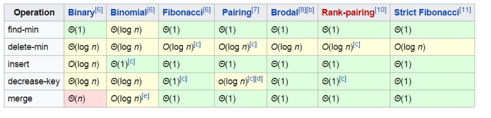
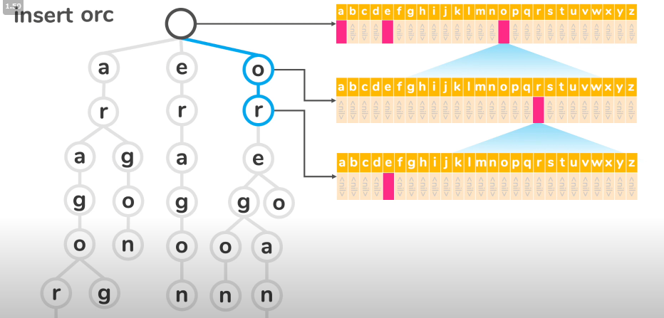
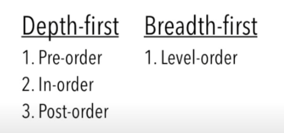
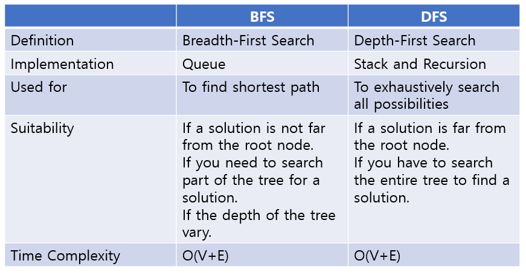
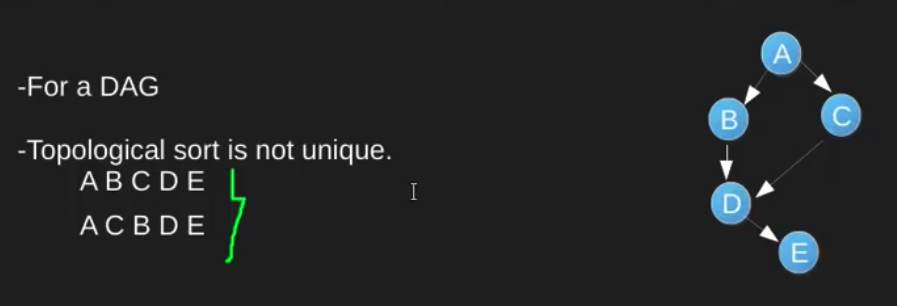
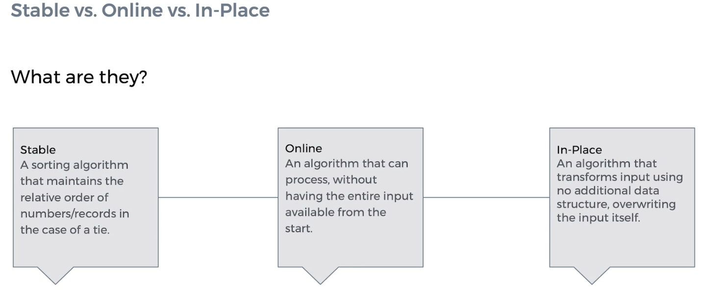

# My notes on DS and Algo

# Table of Contents

1. [Arrays](#arrays)
1. [LinkedList](#LinkedList)

1. [Trees](#Trees)

   1. [Types of trees:](#tts)
   1. [Tree/Graph Traversal Algorithms](#traversal)
   1. [Heap](#heap)
   1. [Priorty Queue](#priority-queue)
   1. [Trie](#trie)

1. [Graphs](#Graphs)
   1. [Graph Data Structure](#gds)
   1. [Tree/Graph Traversal Algorithms](#traversal)
      1. [Binary Tree Traversal](#btt)
      1. [Depth First Search](#dfs)
      1. [BFS](#bfs)
      1. [Topological Sort](#topological-sort)
1. [Algorithms](#Algorithms)
   1. [Others](#others)
   1. [Sorting](#sorting)
   1. [Searching](#searching)
      1. [Binary Search](./DS%20%26%20Algo%20in%20python/binarysearch.md)

## Arrays

Advantages of array

- Reading and writing is O(1)

Disadvantages of array

- Insertion and deletion is O(n)
- Arrays are not dynamic
  - If you need to store an extra element, you would have to create a new array and copy all the elements over. O(n)

List Slicing in python

- [start:stop:step]
- Reverse a list `list[::-1]`

## LinkedList

- Linked lists are great for problems that require arbitrary insertion.
- Dynamic arrays allow inserting at arbitrary locations, but they require you to move all elements after your insertion point.
- Doubly LinkedLists don’t have this problem: you can insert or delete elements in a linked list in constant time, as long as you know where the element is.
- The downside is that they don’t allow constant time access: to find the ith element, you need to traverse i elements, whereas arrays can do this in constant time. .
- Use them where insertion speed is important, but not when you want to access elements based on their index.


## Trees

**Types of trees:** <a name="tts"></a>

- Binary Search Tree (most interview questions are asking about binary search trees)
  - for each node, its left child is less than the node, which is less than its right child.
- Balanced
  - Balanced means the difference between the heights of the left and right subtrees is no more than 1.
  - This ensures O(log n) time for both search and insert.
- Complete
  - A complete binary tree is a binary tree in which every level, except possibly the last, is completely filled, and all nodes are as far left as possible.
- Full
  - A full binary tree is a binary tree in which every node has either 0 or 2 children.
- Perfect
  - Full & Complete
- Binary Heaps (Min/Max)
  - Complete Binary Search Tree where each node is smaller than its childs.
  - the root is the minimum
- Tries(Prefix Trees)

### Binary Search Tree

Binary search trees are useful, because they allow you to find elements in O(log n) time, but unlike a sorted array, you can do insertions at an average of O(log n) time, as opposed to O(n) potentially.


### Heap



- for max heap or min heap, the parent is always greater/less than or equal to the children.

#### Implementation

Array implementation
For an array implementation in heaps, the index starts from 1, not 0. The first index represents a value “root”, which is why it is kept empty.

#### Functions

- Heapify
  - Heapify is a function that turns an unordered array into a heap.
- HeapSort

### Priority Queue

Priority queue is an abstract data type (an interface definition) that defines three operations: `is_empty, insert_with_priority, and pull_highest_priority_element`. The definition says what those functions are expected to do, but it doesn't say how it is to be implemented.

A binary heap is one way to implement a priority queue. Its advantages are ease of implementation and that it is reasonably efficient.

### [Trie](./Datastructure%20and%20Algo%20in%20Golang/trie.go)

- A trie is a kind of tree data structure that is used to store a dynamic set of strings.
- A trie is a tree where each node represents a prefix (or partial key).
- Booleans are used to indicate if a prefix is a complete key or not.

**Advantages of using Trie:**

- It can tell us if a string is a prefix of any valid words and a tree can do it in O(K) time where K is the length of the string.
- Many problems involving list of words can be solved using a trie. In situations when we search through the tree on related prefixes repeatedly (e.g looking up M, then MA,MAN,MANY) we might pass a reference to the current node in the tree

  

Key Functions:

- `insert`: Inserts a new key into the trie.

```
1. For each character in the word, create a new node as a child of the current node if it does not already exist.
2. Mark the current node as complete if it is a prefix of the word.
```

- `search`: Searches for a key in the trie.

Time Complexity:

- `insert`: O(lg n)
- `search`: O(m) where m is the length of the key.
- Tradoff?

Use case:

- many problems involving lists of words leverage trie as optimisation
- Storing a dictionary of words for quick lockup
- autocomplete

## Graphs

- Representing Graphs : <a name="gds"></a>

  - [Adjacency List](./Datastructure%20and%20Algo%20in%20Golang/adjacency_list.go)

    - Every Vertex stores a list of adjacent vertices.
    - Each index of a list could be used to represent the vertex and the elements represent adjacent vertices.

      

  - [Adjacency Matrix](./Datastructure%20and%20Algo%20in%20Golang/adjacency_matrix.go)

    - Representing graphs as 2 dimensional matrix.
      - Edge is represented by the value of i,j in matrix.
      - To add a vertex, add a row and column
    - If the graph is weighted, the value of each matrix would be the weights instead of 1s and 0s.
    - If the graph is undirected, it means that there is symmetry about the diagonal of the matrix, because the edges are bi-directional.

    - Comparing Adjacency Matrix and List

      - Matrix requries more space. n^2
      - Adjancy matrix is faster for Edge lookup O(1) vs O(V)
        Time Complexity

        

### Tree/Graph Traversal Algorithms <a name="traversal"></a>

- Breadth-first search is guaranteed to find a shortest possible path between two vertices in a graph. Depth-first search is not (and usually does not).
- DFS is preferred if we want to visit every node in the graph.
- DFS : Stack ; BFS : Queue

  

#### [Binary Tree Traversal](./Datastructure%20and%20Algo%20in%20Golang/tree_traversal.go) <a name="btt"></a>

**In order**

      1. Visit Left Node
      1. Current Node
      1. Right Node

**Pre Order**

      1. Visit Current Node
      1. Visit Left Node
      1. Visit Right Node

**Post Order**

      1. Visit Left
      1. Right
      1. Current

#### [Depth-First Traversal](./Datastructure%20and%20Algo%20in%20Golang/graph_search.go) <a name="dfs"></a>

- DFS is a recursive algorithm that visits every node in a graph, starting from the source node and proceeding along the edges of the graph.
- DFS implements the order traversal just that it has 'visited' mark, so that it does not repeat the visiting.

#### [Breadth-First Traversal](<(./Datastructure%20and%20Algo%20in%20Golang/graph_search.go)>) <a name="bfs"></a>

- BFS is a iterative algorithm that uses a queue to store the nodes that need to be visited.

**Algorithm:**

```
1. Enqueue the source node
2. while the queue is not empty, dequeue a node
3. Visit the node if not visited
4. Enqueue the children of the node
```

[Ref video](https://www.youtube.com/watch?v=QRq6p9s8NVg&ab_channel=GoGATEIIT)

#### DFS VS BFS



### Topological Sort

Topological Sort is a linear ordering of vertices such that for every directed edge uv from vertex u to vertex v, u comes before v in the ordering.



Degree of a vertex is the number of edges connected to it.

| In degree :                                                                                         | Out degree :                                             |
| --------------------------------------------------------------------------------------------------- | -------------------------------------------------------- |
| In degree is the number of edges coming into a vertex. In degree is 0 if the vertex is a leaf node. | Out degree is the number of edges going out of a vertex. |

Applications

- Task Scheduling
- Build Systems
- Course Scheduling

Algorithm:

```
1. Create a set of all vertices with no incoming edges
2. While there are vertices in the set
    1. Pick a vertex u
    2. Remove u from the set
    3. For each vertex v such that there is an edge from u to v
        1. Remove edge uv from graph
        2. Add v to the set
```

# Algorithms

## Others


Stable : Maintains the relative order of elements with the same key.
Online : Algorithm can operate without seeing the entire list of elements. O(1)
In place : Uses additional space to store the result.
